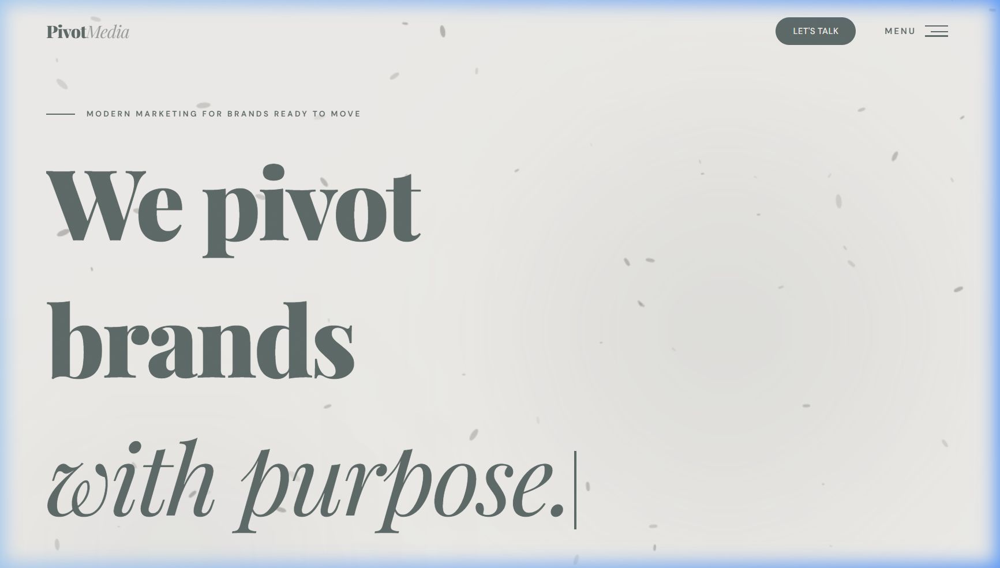
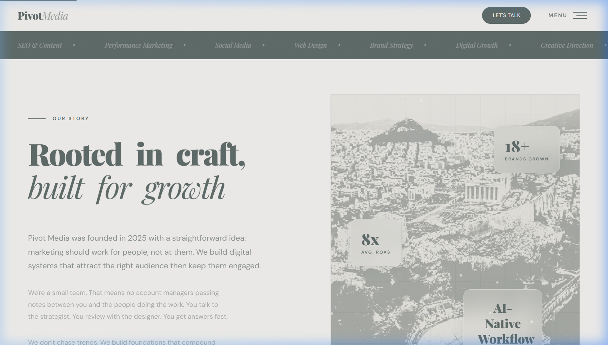
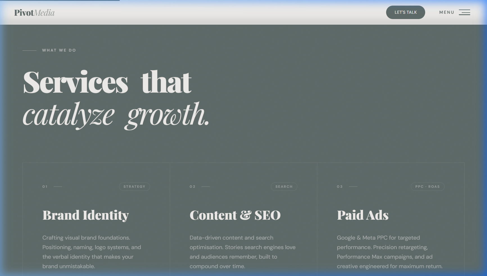
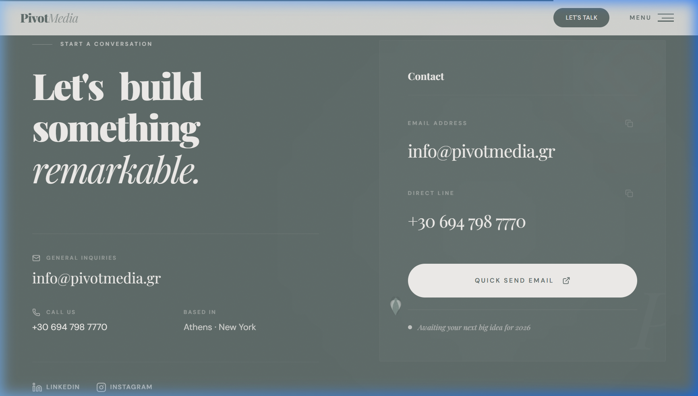
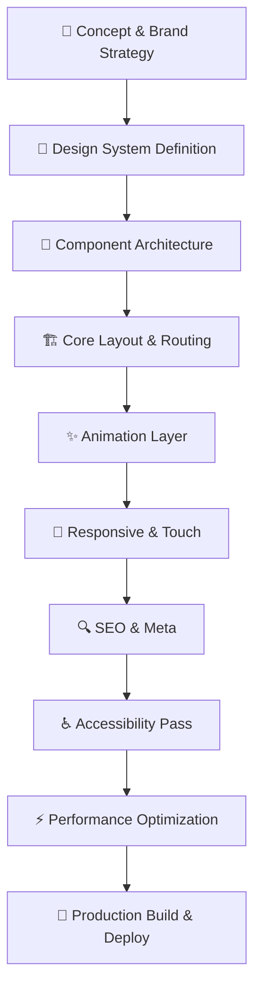

<div align="center">

<svg xmlns="http://www.w3.org/2000/svg" viewBox="0 0 400 200" width="100%" height="100%">
  <defs>
    <style>
      @keyframes sway {
        0%, 100% { transform: rotate(-3deg) translateY(0px); }
        25% { transform: rotate(2deg) translateY(-5px); }
        75% { transform: rotate(3deg) translateY(5px); }
      }
      @keyframes float {
        0%, 100% { transform: translateY(0px); opacity: 0.15; }
        50% { transform: translateY(-15px); opacity: 0.25; }
      }
      .leaf {
        animation: sway 4s ease-in-out infinite;
        transform-origin: center;
      }
      .leaf-shadow {
        animation: float 3s ease-in-out infinite;
        fill: #8fbc8f;
      }
      .main-leaf {
        fill: #4a7c59;
      }
    </style>
  </defs>
  <rect width="100%" height="100%" fill="#0d1117" rx="10" />
  <ellipse class="leaf-shadow" cx="200" cy="160" rx="40" ry="8" />
  <g class="leaf">
    <path class="main-leaf" d="M200,150 C200,150 160,100 160,70 C160,40 200,20 200,20 C200,20 240,40 240,70 C240,100 200,150 200,150 Z" />
    <path d="M200,150 L200,170" stroke="#4a7c59" stroke-width="3" stroke-linecap="round" />
  </g>
</svg>

# 🌿 Pivot Media — Premium Digital Marketing Agency

### A modern, award-quality agency website built with React, Vite & Framer Motion

[](https://react.dev/)
[](https://vite.dev/)
[](https://tailwindcss.com/)
[](https://motion.dev/)
[](https://gsap.com/)
[](LICENSE)

[](https://pivotmedia.gr)

**Live Site →** [pivotmedia.gr](https://pivotmedia.gr)

</div>

---

## 📸 Screenshots

<details open>
<summary><strong>🏠 Hero Section</strong></summary>



> The hero features a cinematic particle canvas, network particle connections, a typewriter cycling effect, and staggered text reveals — all layered with premium background blurs.

</details>

<details>
<summary><strong>📖 About Section</strong></summary>



> "Our Story" section with animated stat counters (18+ brands, 8x ROAS, etc.), scroll-triggered reveals, and organic leaf accent imagery throughout.

</details>

<details>
<summary><strong>⚡ Services Section</strong></summary>



> Seven service cards with hover-activated leaf imagery, magnetic cursor effects, and staggered entrance animations. Each card expands to reveal detailed descriptions.

</details>

<details>
<summary><strong>📬 Contact Section</strong></summary>



> Split-layout contact section with copy-to-clipboard functionality, animated social links, and a glassmorphism contact card with backdrop blur.

</details>

---

## 🧠 The Vision & Thought Process

### The Problem
Most agency websites feel either too corporate and sterile, or too chaotic and unfocused. I wanted to create something that felt **alive** — a digital experience that communicates premium quality before a single word is read.

### The Concept: "Organic Growth"
The entire brand identity is rooted in a **botanical/nature metaphor**:
- 🌱 **Growth** — brands growing like plants reaching for light
- 🍃 **Organic** — authentic, natural marketing that pulls rather than pushes
- 🌊 **Flow** — smooth, fluid interactions that feel effortless
- 🌿 **Sage green** as the primary color — trust, growth, sophistication

### Design Philosophy
```
Premium ≠ Complicated

The goal was to make something that feels expensive and intentional,
where every pixel, every animation, every interaction has purpose.
```

**Key design decisions:**
1. **Serif + Sans pairing** — Playfair Display for headlines (editorial elegance) + DM Sans for body (modern readability)
2. **Muted, earthy palette** — sage greens, warm creams, deep charcoals instead of harsh neons
3. **Generous whitespace** — letting the design breathe creates perception of luxury
4. **Micro-interactions everywhere** — custom cursor, magnetic elements, scroll-triggered reveals
5. **Film grain overlay** — subtle noise texture adds analog warmth to a digital experience

---

## 🏗️ Architecture & Project Structure

```
pivot-media/
├── public/
│   ├── assets/                 # Static images & leaf textures
│   │   ├── cursor/             # Custom cursor assets
│   │   ├── leaf_*.png/jpg      # Botanical accent imagery
│   │   └── about_bg.jpg        # About section background
│   ├── .htaccess               # Apache URL rewriting rules
│   ├── robots.txt              # SEO crawl directives
│   └── sitemap.xml             # XML sitemap for search engines
│
├── src/
│   ├── components/
│   │   ├── sections/           # Page sections (below)
│   │   │   ├── Hero/           # Hero with particles & typewriter
│   │   │   │   ├── index.jsx
│   │   │   │   ├── ParticleCanvas.jsx
│   │   │   │   └── Typewriter.jsx
│   │   │   ├── About.jsx       # Company story & stats
│   │   │   ├── Services.jsx    # 7 service cards with hover reveals
│   │   │   ├── Process.jsx     # 4-step process timeline
│   │   │   ├── Numbers.jsx     # Animated statistics
│   │   │   ├── Works.jsx       # Portfolio/case studies
│   │   │   ├── Contact.jsx     # Contact info & CTA
│   │   │   ├── CTA.jsx         # Call-to-action banner
│   │   │   ├── Reel.jsx        # Video showcase
│   │   │   └── Marquee.jsx     # Infinite scrolling text
│   │   │
│   │   ├── Navigation.jsx      # Fullscreen menu with GSAP
│   │   ├── Footer.jsx          # Site footer with links
│   │   ├── CustomCursor.jsx    # Context-aware custom cursor
│   │   ├── FluidAquarium.jsx   # Fluid simulation background
│   │   ├── NetworkParticles.jsx # Connected particle network
│   │   ├── OceanWaves.jsx      # Animated wave divider
│   │   ├── RootSystem.jsx      # Growing vine/root animation
│   │   ├── ScrollVine.jsx      # Scroll-following vine element
│   │   ├── VineWave.jsx        # Organic wave transition
│   │   ├── WaterDropTrigger.jsx # Water drop click effect
│   │   ├── ScrollProgress.jsx  # Scroll progress indicator
│   │   ├── CookieConsent.jsx   # GDPR cookie consent banner
│   │   ├── Loader.jsx          # Page loading animation
│   │   ├── Button.jsx          # Reusable magnetic button
│   │   ├── Magnetic.jsx        # Magnetic hover wrapper
│   │   ├── RevealText.jsx      # Scroll-reveal text animation
│   │   ├── WavyText.jsx        # Wavy text hover animation
│   │   ├── WavyDivider.jsx     # SVG wave section divider
│   │   ├── OrganicDivider.jsx  # Organic shape divider
│   │   └── PivotText.jsx       # Branded text treatment
│   │
│   ├── pages/
│   │   ├── GeoFAQ.jsx          # Local SEO FAQ page
│   │   ├── PrivacyPolicy.jsx   # GDPR privacy policy
│   │   └── TermsOfService.jsx  # Terms & conditions
│   │
│   ├── utils/
│   │   ├── cn.js               # clsx + tailwind-merge utility
│   │   └── lerp.js             # Linear interpolation helper
│   │
│   ├── App.jsx                 # Root app with routing & state
│   ├── App.css                 # App-level styles
│   ├── main.jsx                # Entry point with React Router
│   └── index.css               # Global styles & design tokens
│
├── index.html                  # Entry HTML with full SEO markup
├── vite.config.js              # Vite + React + Tailwind config
├── package.json                # Dependencies & scripts
├── eslint.config.js            # ESLint configuration
└── .gitignore                  # Git ignore rules
```

---

## ✨ Key Features & Technical Highlights

### 🎨 Visual & Animation System
| Feature | Technology | Description |
|---------|-----------|-------------|
| **Custom Cursor** | Framer Motion + Canvas | Context-aware cursor that changes shape/text based on hovered element |
| **Particle Canvas** | HTML5 Canvas API | Floating particles with parallax depth effect |
| **Network Particles** | Canvas + Math | Connected particle network that responds to mouse proximity |
| **Root System** | Canvas + requestAnimationFrame | Growing vine/root animation that follows scroll position |
| **Ocean Waves** | SVG + CSS Animations | Multi-layered wave divider with parallax scrolling |
| **Text Reveals** | Framer Motion + IntersectionObserver | Characters slide up from below viewport on scroll |
| **Typewriter** | Custom React Hook | Cycling text with realistic typing/deleting cadence |
| **Magnetic Elements** | GSAP + Mouse Events | Buttons and links that magnetically pull toward cursor |
| **Film Grain** | Inline SVG + CSS Animation | Subtle analog noise overlay for warmth |
| **Scroll Progress** | Framer Motion `useScroll` | Top-of-page progress indicator |

### 🚀 Performance
- **Lenis smooth scroll** — buttery-smooth scrolling with configurable lerp
- **Touch device detection** — disables heavy canvas animations on mobile
- **Reduced motion support** — respects `prefers-reduced-motion` media query
- **Lazy animations** — scroll-triggered via `IntersectionObserver` (nothing animates offscreen)
- **Vite bundling** — near-instant HMR and optimized production builds

### 🔍 SEO & Technical SEO
- **JSON-LD structured data** — Organization, ProfessionalService, WebSite, WebPage schemas
- **Open Graph + Twitter Cards** — rich social media previews
- **Bilingual meta tags** — English + Greek for international targeting
- **Geographic meta** — `geo.region`, `geo.position`, ICBM coordinates
- **Canonical URLs** + `hreflang` alternates
- **Semantic HTML5** — proper `section`, `header`, `footer`, `main`, `nav` elements
- **XML Sitemap** + `robots.txt`
- **Apache `.htaccess`** — URL rewriting for SPA routing

### ♿ Accessibility
- Proper `aria-label` attributes on all sections
- Keyboard navigation support
- Color contrast compliance
- Semantic heading hierarchy (`h1` → `h2` → `h3`)
- Focus management

### 📱 Responsive Design
- Fluid typography with `clamp()` for all headings
- CSS Grid + Flexbox layouts that adapt from mobile → desktop
- Touch-optimized: disables custom cursor and heavy effects on `pointer: coarse` devices
- Viewport-fit: cover for notched devices

---

## 🔄 Design & Development Workflow



### Phase 1 — Brand & Design System
Defined the visual language first: color tokens (sage, cream, charcoal), typography pairing (Playfair Display + DM Sans), spacing scale, and animation curves. This became the foundation everything else builds on.

### Phase 2 — Component Architecture
Designed a modular component tree where each section is self-contained with its own scroll-triggered animations. Shared animation components (`RevealText`, `Magnetic`, `WavyText`) are reusable across sections.

### Phase 3 — Animation Layering
Built animations in layers: base layout → entrance animations → scroll-triggered effects → hover micro-interactions → ambient background effects (particles, roots, waves). Each layer is independently toggleable for performance.

### Phase 4 — Progressive Enhancement
Added features that gracefully degrade: custom cursor only on pointer devices, particle canvases only on desktop, reduced motion mode disables all animations. The core content works everywhere.

### Phase 5 — SEO & Polish
Final pass for structured data, meta tags, performance auditing, and cross-browser testing. Added GDPR-compliant cookie consent, privacy policy, and terms of service pages.

---

## 🛠️ Tech Stack

| Category | Technology | Why |
|----------|-----------|-----|
| **Framework** | React 19 | Component model, hooks, concurrent features |
| **Build Tool** | Vite 7 | Instant HMR, optimized builds, ESM-native |
| **Styling** | Tailwind CSS 4 | Utility-first with custom design tokens |
| **Animation** | Framer Motion 12 | Declarative animations with gesture support |
| **Animation** | GSAP 3 | Timeline-based animations for complex sequences |
| **Smooth Scroll** | Lenis | Smooth, native-like scrolling with lerp control |
| **Icons** | Lucide React | Tree-shakeable, consistent icon set |
| **Routing** | React Router 7 | Client-side routing for SPA |
| **Utilities** | clsx + tailwind-merge | Conditional class merging without conflicts |

---

## 🚀 Getting Started

### Prerequisites
- **Node.js** ≥ 18.0
- **npm** ≥ 9.0

### Installation

```bash
# Clone the repository
git clone https://github.com/kstra3/Pivot_Website.git

# Navigate to the project
cd Pivot_Website/pivot-media

# Install dependencies
npm install

# Start development server
npm run dev
```

The dev server will start at `http://localhost:5173`

### Available Scripts

| Command | Description |
|---------|-------------|
| `npm run dev` | Start Vite dev server with HMR |
| `npm run build` | Production build to `dist/` |
| `npm run preview` | Preview production build locally |
| `npm run lint` | Run ESLint across the project |

### Production Build

```bash
npm run build
```

Outputs optimized static files to `dist/` — ready to deploy to any static hosting (Netlify, Vercel, Cloudflare Pages, etc.)

---

## 🎯 Design Decisions Deep Dive

### Why a Single-Page App?
An agency website is fundamentally a **narrative experience**. Visitors should flow through the story — from who we are, to what we do, to how we work, to getting in touch. SPA architecture with smooth scroll creates this seamless journey without page-load interruptions.

### Why Sage Green?
Color psychology: green = growth, trust, stability. Sage specifically avoids the "techbro" neon green and feels more **mature, editorial, and premium**. Paired with warm cream backgrounds, it creates an organic, inviting atmosphere.

### Why Custom Cursor?
The cursor is a constant UI element — making it contextual (showing labels like "View", "Submit", "Call" on hover) turns passive browsing into an **interactive exploration**. It makes users feel like they're discovering, not just scrolling.

### Why Botanical Imagery?
The leaf/plant motif reinforces the "organic growth" brand metaphor at every level: from the logo (🌿), to section accents, to the root system background animation. It's not decoration — it's **brand storytelling through visual design**.

---

## 📄 Legal Pages

The site includes GDPR-compliant legal pages:
- **Privacy Policy** (`/privacy`) — Full GDPR compliance with data processing details
- **Terms of Service** (`/terms`) — Service terms and intellectual property
- **Cookie Consent** — Banner with accept/decline, persisted to localStorage

---

## 🌍 Deployment

The site is deployed at [pivotmedia.gr](https://pivotmedia.gr) and is configured for:
- Apache hosting with `.htaccess` SPA routing
- SSL/HTTPS enforcement
- Gzip compression
- Browser caching headers

---

## 📝 License

This project is open source and available under the [MIT License](LICENSE).

---
<div align="center">

**Built with 🌿 by [Pivot Media](https://pivotmedia.gr)**

*Athens · New York*

</div>